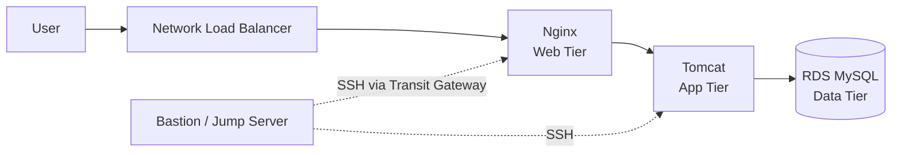

# AWS 3-Tier Java Login App

A Java login and registration web app deployed on AWS using a 3-tier architecture: **Web (Nginx) → App (Tomcat) → Database (RDS MySQL)**. It's built with a simple CI flow: Maven builds the app, SonarCloud scans the code, and JFrog stores the artifact.

> ### 🙏 Credit
>
> This project is based on **[DevOps-Project-01](https://github.com/NotHarshhaa/DevOps-Projects/tree/master/DevOps-Project-01)** by **[@NotHarshhaa](https://github.com/NotHarshhaa)**, part of the excellent **[DevOps-Projects](https://github.com/NotHarshhaa/DevOps-Projects)** collection.
> Huge thanks for creating and sharing this learning material. Go give the original repo a ⭐!

---

## Architecture



- **Two VPCs:** a Bastion VPC (`192.168.0.0/16`) and an App VPC (`172.32.0.0/16`), connected through a **Transit Gateway**.
- **Private subnets** for the web, app, and database tiers. Only the load balancer is public.
- **Security groups** are chained, so each tier only accepts traffic from the tier in front of it.

## Tech Stack

| Area            | Tools                                                                    |
| --------------- | ------------------------------------------------------------------------ |
| Cloud           | AWS (VPC, EC2, RDS, NLB, Transit Gateway, S3, IAM, CloudWatch, Route 53) |
| Web / App       | Nginx, Apache Tomcat 9, Java 11, Spring Boot                             |
| Database        | MySQL (Amazon RDS)                                                       |
| Build & Quality | Maven, SonarCloud                                                        |
| Artifacts       | JFrog Artifactory                                                        |

## How It Works

1. Maven builds the app into a `.war` file.
2. SonarCloud scans the code for bugs and security issues.
3. The `.war` is published to JFrog Artifactory.
4. Tomcat servers pull the `.war` from JFrog and run the app.
5. Users reach the app through the load balancer → Nginx → Tomcat, which reads and writes to RDS.

## What I Did

- Built the whole infrastructure through the **AWS Console**, translating the guide's CLI commands into console steps.
- Adapted the setup to fit the **AWS Free plan**, e.g., Single-AZ RDS on a micro instance.
- Set up my own **SonarCloud** project and a self-hosted **JFrog Artifactory**.
- Removed hard-coded credentials and switched to **environment variables** for secrets.

## Running the Build

```bash
export SONAR_TOKEN=your-sonar-token
export JFROG_USERNAME=your-username
export JFROG_PASSWORD=your-password

mvn clean verify sonar:sonar deploy
```

## Screenshots

_Add screenshots here: the running login page, the AWS resources, the SonarCloud report, and the artifact in JFrog._

---

⭐ Original project: [NotHarshhaa/DevOps-Projects](https://github.com/NotHarshhaa/DevOps-Projects)
